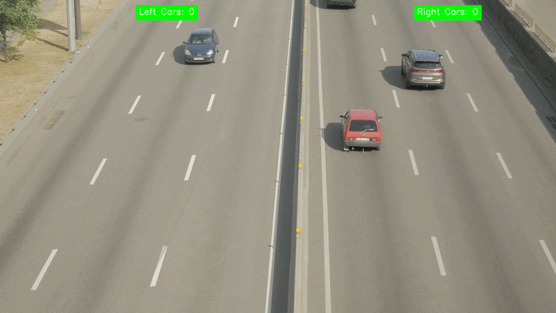
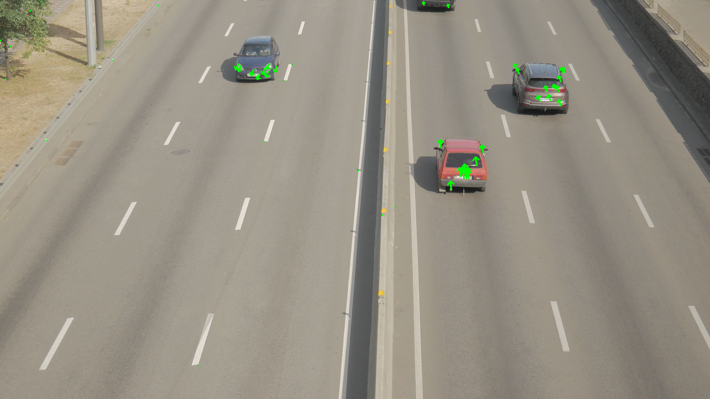
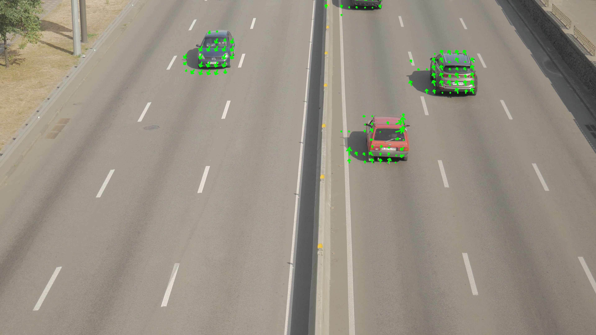

# Understanding Optical Flow for Motion Detection — From Concepts to Application

A hands-on notebook that walks through optical flow from first principles to a real-world traffic direction counter, combining the Farneback dense flow method with YOLO object detection.

[](https://medium.com/@sagar100rathod/84b6023607b6) [](...)

---

## Demo



---

## What You'll Learn

- How the **brightness constancy assumption** underpins all classical optical flow.
- Deriving and implementing the **Lucas–Kanade algorithm from scratch** using spatial and temporal gradients.
- The difference between **sparse optical flow** (tracking corner features) and **dense optical flow** (estimating motion for every pixel).
- Using the **Farneback method** to build a motion detection pipeline with magnitude thresholding, morphological closing, and connected-component filtering.
- Combining **YOLO** with dense optical flow to count vehicles by traffic direction.

---

## Results

**Sparse Optical Flow — Lucas–Kanade**



**Dense Optical Flow — Farneback**



---

## Run It

**Option 1 — Google Colab (no local setup needed)**

[](https://colab.research.google.com/github/sagar100rathod/car-traffic-direction-using-optical-flow/blob/main/motion_detection_with_optical_flow.ipynb)

**Option 2 — Run Locally**

```bash
git clone https://github.com/sagar100rathod/car-traffic-direction-using-optical-flow.git
cd car-traffic-direction-using-optical-flow
pip install opencv-python numpy pillow matplotlib tqdm ultralytics
jupyter notebook motion_detection_with_optical_flow.ipynb